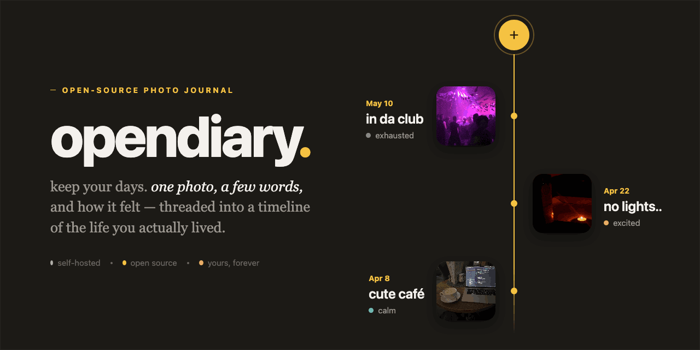

# opendiary

A self-hosted photo journal. Every entry is a date, a few words, a photo, and how
it felt — threaded down a vertical timeline of the life you actually lived. One
entry per day, with side panels for stats, a calendar, and recent moments.

## Stack

SvelteKit 2 (Svelte 5 runes, TypeScript, adapter-node) · PostgreSQL via Drizzle ORM ·
JWT auth in an httpOnly cookie · images on disk · installable as a PWA.

## Quick start (Docker)

```sh
cp .env.example .env        # set JWT_SECRET to a long random string
docker compose up -d
```

The app comes up on http://localhost:3000. Postgres runs in a sibling container and
database migrations are applied automatically on startup.

## Configuration

Set via the environment (see `docker-compose.yml` for the container defaults):

| Variable          | Purpose                                            |
| ----------------- | -------------------------------------------------- |
| `DATABASE_URL`    | PostgreSQL connection string                       |
| `JWT_SECRET`      | Secret used to sign session tokens                 |
| `UPLOADS_DIR`     | Directory where uploaded images are stored         |
| `HTTPS`           | `1` to mark the session cookie `Secure` (HTTPS)    |
| `BODY_SIZE_LIMIT` | Max request size, i.e. the largest accepted photo  |

## Local development

```sh
npm install
docker compose up -d db     # or point DATABASE_URL at your own Postgres
cp .env.example .env
node migrate.mjs            # apply migrations
npm run dev
```

`npm run check` runs type checking. Migrations live in `drizzle/` and are generated
from the schema in `src/lib/server/db.ts` with `npx drizzle-kit generate`.
